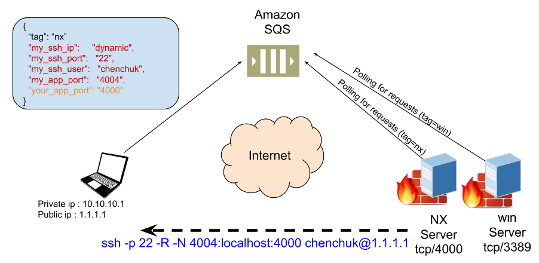

# pytunnel

## SSH reverse tunneling system
This system is used to connet to a remote server behind a firewall using reverse ssh tunnel.

### System structure
* client machine
* server machine
* shared queue



The client (publicly accessible) will send a request for tunnel creation to a shared queue (Amazon SQS queue) since it cant access the server directly.

The server listens forever to the shared queue. when a request received, the server creates a reverse SSH tunnel to the client and will map one of
its TCP ports to the client machine.

The client can then connect to that port using localhost:port

### Prerequisites:
The server can access the client (ie. it can authenticate using ssh keys).
```
$ ssh user@client_ip
```
***
#### Running the server side:
set environment variables by edit config file. 
Those vars used by the server to fetch messages from a shared queue
```
export AWS_ACCESS_KEY_ID=XXX
export AWS_SECRET_ACCESS_KEY=XXX
export AWS_DEFAULT_REGION=XXX
export QUEUE_URL=XXX
```
source the config file and run the server side. the servers will start poll the queue
```
$ . config
$ ./pytunnel.py --d
```
***
#### running the client side:
Edit the request file chen-work.json
NOTE:
* ip can be 'dynamic'. this allow the requester host to inject its own public ip

source config and request a tunnel
```
$ . config
$ ./pytunnel.py --r chen-work.json
```

